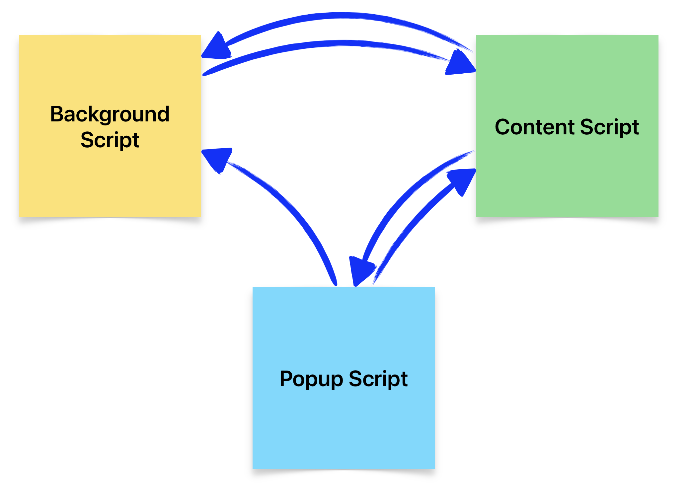

# <p align="center"> **`Chrome Extension Message Passing v3`** </p>



## Background script to Content script
> ### Background script Sender
```js
   chrome.tabs.onUpdated.addListener((tabId, tab) => {
      if (tab.status == "complete") {
         chrome.tabs.sendMessage(tabId, {
            type: "background to content",
         }, (response) => {
            console.log(response);
         });
      };
   });
```
> ### Content script Receiver
```js
   chrome.runtime.onMessage.addListener((request, sender, sendResponse) => {
      if (request.type === "background to content") {
         sendResponse({ farewell: "response form content script to background" });
      }
      return true;
   });
```
<br>

## Content script to Background scri
> ### Content script Sender
```js
   chrome.runtime.sendMessage({
      type: "content to background",
   }, (response) => {
      console.log(response);
   });
```
> ### Background script Receiver
```js
   chrome.runtime.onMessage.addListener((request, sender, sendResponse) => {
      if (request.type === "content to background") {
         sendResponse({ farewell: "response from background script content" });
      }
      return true;
   });
```
<br>

## Content script to Popup script
> ### Content script Sender
```js
   chrome.runtime.sendMessage({
      type: "content to popup",
   }, (response) => {
      console.log(response);
   });
```
> ### Popup script Receiver
```js
   chrome.runtime.onMessage.addListener((request, sender, sendResponse) => {
      if (request.type === "content to popup") {
         sendResponse({ message: "response form popup script to content" });
      }
      return true;
   });
```
<br>

## Popup script to Content script
> ### Popup script Sender
```js
   document.addEventListener("DOMContentLoaded", () => {
      chrome.tabs.query({ active: true, currentWindow: true }).then(([tab]) => {
         chrome.tabs.sendMessage(
            tab.id,
            { type: "popup to content" },
            (response) => {
               console.log(response);
            }
         );
      });
   });
```
> ### Content script Receiver
```js
   chrome.runtime.onMessage.addListener((request, sender, sendResponse) => {
      if (request.type === "popup to content") {
         sendResponse({ farewell: "response form content script to popup" });
      }
      return true;
   });
```
<br>

## Popup script to Background script
> ### Popup script Sender
```js
   chrome.runtime.sendMessage({ type: "popup to background" }, (response) => {
      console.log(response);
   });
```
> ### Background script Receiver
```js
   chrome.runtime.onMessage.addListener((request, _, sendResponse) => {
      if (request.type === "popup to background") {
         sendResponse({ farewell: "response from background script popup" });
      }
      return true;
   });
```